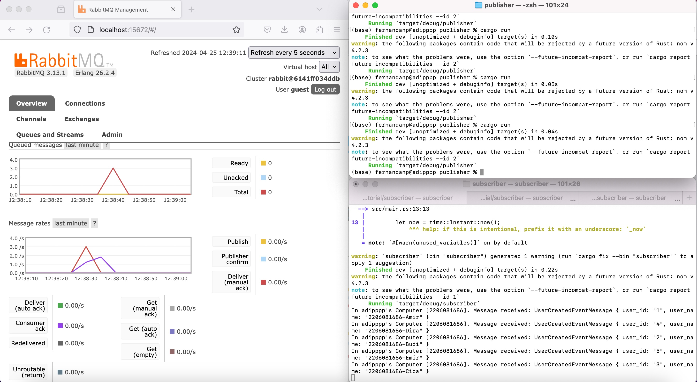

# tutorial-8-subscriber

## Reflection 1a
AMQP stands for Advanced Message Queuing Protocol. It is an open standard protocol for message-oriented middleware, enabling the systems to communicate with each other via messaging. AMQP defines a set of rules for systems to follow so they can communicate and exchange messages, regardless of the underlying platform or language.

AMQP is commonly used in enterprise environments where different systems, possibly written in different programming languages or running on different platforms, need to communicate reliably and efficiently. It competes with other messaging protocols and standards such as MQTT, which is typically lighter and more suited for IoT devices, and JMS (Java Message Service), which is specific to Java environments.

## Reflection 1b
The first part of the URI, "guest:guest", defines username and password. In this case, the "guest" before the colon (:) is the username and the "guest" after the colon is the password. Moving to the second part of the URI, "localhost" defines the hostname or IP address while the integer after the colon (:) to the right of it defines the port where the AMQP server is running.

## Images

The total number of queue in my machine is 2, namely user_created and user_created_dead_letter. The number of queues is in correlation with the number of listeners created in the subscriber app. However, even though we only created one listener, there seems to be additional queues in RabbitMQ. For example, besides the queue user_created that was created by assigning a listener on the event of `user_created`, there is also the queue user_created_dead_letter.

This additional queue is automatically created by setting the field `use_dead_letter` of struct `QueueProperties` that is passed as an argument to the `QueueListener.listen` method to `true`. It represents a queue for "dead-lettered" messages, which means these messages are republished to an exchange when any of the following events occur:

- The message is negatively acknowledged by a consumer using `basic.reject` or `basic.nack` with `requeue ` parameter set to `false`.
- The message expires due to per-message TTL, or
- The message is dropped because its queue exceeded a length limit

This queue provides a way to handle these failed messages, either by retrying the operation, debugging the cause of the failure, or archiving the failed messages.

The image above shows the RabbitMQ dashboard with 3 subscriber apps listening to the same message broker endpoint. As we can see, the Consumer ack spike is reduced quicker than before. We can also see that the number of messages in the queue is less than before as well. This happens because the messages are being consumed at a higher rate by 3 subscriber apps compared to 1 subscriber apps from before. Higher amounts of messages consumed at a time also leads to lower amount of pending messages being put into the queue.

About the code, I don't actually see much room for improvements. The only improvement I could think about is avoiding hard-coding the connection url to the code. I would prefer to put it in a config file or environment variable and make the code read the file or the variable. The same goes for the publisher app.
